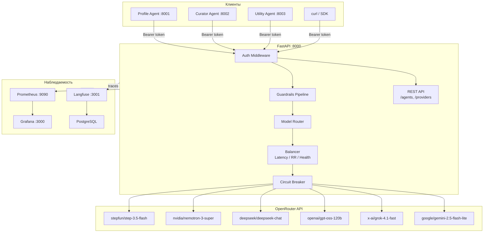

# LLM Agent Platform

Домашнее задание по бонус-треку LLM (ИТМО, магистратура AI, 2025-2026).

| | |
|---|---|
| **Трек** | Инфраструктурный - Разработка Агентной платформы |
| **Автор** | Дмитрий Горбунов |
| **Сроки** | 23.03.2026 - 12.04.2026 |

---

## Описание

API-шлюз для LLM-запросов с балансировкой нагрузки, реестром агентов, guardrails и телеметрией.

Платформа предоставляет OpenAI-совместимые эндпоинты `/v1/chat/completions` и `/v1/embeddings`, за которыми стоит пул из 7 LLM-провайдеров (через OpenRouter) с интеллектуальной маршрутизацией.

### Развернутые сервисы (85.198.96.191)

| Сервис | URL | Логин | Пароль |
|--------|-----|-------|--------|
| Platform API | http://85.198.96.191:8000 | - | - |
| Grafana (метрики) | http://85.198.96.191:3002 | admin | admin |
| Prometheus | http://85.198.96.191:9090 | - | - |
| Langfuse (трейсы) | http://85.198.96.191:3001 | admin@platform.local | admin12345 |

Подключенный агент: [eventai-agent](https://github.com/demoday-ai/eventai-agent) (Telegram-бот [@demoday_ai_talent_hub_test_bot](https://t.me/demoday_ai_talent_hub_test_bot))

Возможности:
- Проксирование запросов к LLM: chat completions (streaming SSE) + embeddings
- Балансировка нагрузки: round-robin, latency-based (EMA), health-aware фильтрация
- Circuit breaker на уровне провайдера
- A2A Agent Registry с Agent Card и токенами
- Guardrails: детекция prompt injection, маскирование секретов в ответах
- Авторизация: master-токен (полный доступ) + agent-токены (`/v1/chat/completions`, `/v1/embeddings`)
- Телеметрия: OpenTelemetry tracing, Prometheus метрики, Grafana дашборды, Langfuse трассировка
- Три демо-агента: Profile, Curator (tool use), Utility

---

## Архитектура



Подробные диаграммы (поток запроса, регистрация агента, circuit breaker, наблюдаемость): [docs/architecture.md](docs/architecture.md)

---

## Быстрый старт

### Требования

- Docker + Docker Compose
- API-ключ [OpenRouter](https://openrouter.ai)

### Запуск

```bash
# 1. Клонировать репозиторий
git clone https://github.com/dpGorbunov/llm-agent-platform.git && cd llm-agent-platform

# 2. Создать .env
cp .env.example .env
# Вписать OPENROUTER_API_KEY и MASTER_TOKEN в .env

# 3. Запустить все сервисы
docker compose up --build
```

Все остальное настраивается автоматически: Langfuse создаёт организацию, проект и API-ключи, агенты регистрируются на платформе, провайдеры seed-ируются, Grafana подключается к Prometheus.

После запуска доступны:

| Сервис | URL | Логин |
|--------|-----|-------|
| API (платформа) | http://localhost:8000 | - |
| Swagger UI | http://localhost:8000/docs | - |
| Profile Agent | http://localhost:8001 | - |
| Curator Agent | http://localhost:8002 | - |
| Utility Agent | http://localhost:8003 | - |
| Prometheus | http://localhost:9090 | - |
| Grafana | http://localhost:3000 | admin / admin |
| Langfuse | http://localhost:3001 | admin@platform.local / admin12345 |

### Swagger UI

Интерактивная документация: http://localhost:8000/docs

Для авторизации нажать кнопку **Authorize** (замок) и вставить master-токен из `.env`.

### Проверка работоспособности

```bash
# Health-check
curl http://localhost:8000/health

# Тестовый запрос к LLM
curl -X POST http://localhost:8000/v1/chat/completions \
  -H "Authorization: Bearer $MASTER_TOKEN" \
  -H "Content-Type: application/json" \
  -d '{
    "model": "deepseek/deepseek-chat",
    "messages": [{"role": "user", "content": "Hello!"}],
    "stream": false,
    "max_tokens": 100
  }'
```

---

## API Reference

### Авторизация

Все запросы (кроме `/health`, `/metrics`, `/docs`) требуют заголовок:

```
Authorization: Bearer <token>
```

Два типа токенов:
- **Master-токен** - полный доступ ко всем эндпоинтам
- **Agent-токен** - доступ только к `/v1/chat/completions`

---

### POST /v1/chat/completions

OpenAI-совместимый эндпоинт для генерации ответов LLM.

**Параметры запроса:**

| Параметр | Тип | Обязательный | Описание |
|----------|-----|:---:|----------|
| `model` | string | да | Идентификатор модели |
| `messages` | array | да | Массив сообщений `{role, content}` |
| `stream` | bool | нет | SSE-стриминг (по умолчанию: false) |
| `temperature` | float | нет | Температура генерации |
| `max_tokens` | int | нет | Максимум токенов в ответе |
| `top_p` | float | нет | Top-p sampling |
| `frequency_penalty` | float | нет | Штраф за частоту |
| `presence_penalty` | float | нет | Штраф за присутствие |
| `stop` | string/array | нет | Стоп-последовательности |

**Запрос (non-streaming):**

```bash
curl -X POST http://localhost:8000/v1/chat/completions \
  -H "Authorization: Bearer $MASTER_TOKEN" \
  -H "Content-Type: application/json" \
  -d '{
    "model": "deepseek/deepseek-chat",
    "messages": [{"role": "user", "content": "Что такое FastAPI?"}],
    "stream": false,
    "max_tokens": 200
  }'
```

**Запрос (streaming):**

```bash
curl -N -X POST http://localhost:8000/v1/chat/completions \
  -H "Authorization: Bearer $MASTER_TOKEN" \
  -H "Content-Type: application/json" \
  -d '{
    "model": "deepseek/deepseek-chat",
    "messages": [{"role": "user", "content": "Что такое FastAPI?"}],
    "stream": true
  }'
```

---

### POST /agents

Регистрация нового агента. Возвращает agent-токен для авторизации.

```bash
curl -X POST http://localhost:8000/agents \
  -H "Authorization: Bearer $MASTER_TOKEN" \
  -H "Content-Type: application/json" \
  -d '{
    "name": "my-agent",
    "description": "My custom agent",
    "methods": ["run"],
    "endpoint_url": "http://my-agent:9000"
  }'
```

### GET /agents

Список всех зарегистрированных агентов (токены скрыты).

```bash
curl http://localhost:8000/agents \
  -H "Authorization: Bearer $MASTER_TOKEN"
```

### GET /agents/{id}

Получение агента по UUID.

```bash
curl http://localhost:8000/agents/{id} \
  -H "Authorization: Bearer $MASTER_TOKEN"
```

### DELETE /agents/{id}

Удаление агента.

```bash
curl -X DELETE http://localhost:8000/agents/{id} \
  -H "Authorization: Bearer $MASTER_TOKEN"
```

---

### POST /providers

Добавление LLM-провайдера.

```bash
curl -X POST http://localhost:8000/providers \
  -H "Authorization: Bearer $MASTER_TOKEN" \
  -H "Content-Type: application/json" \
  -d '{
    "name": "My Provider",
    "base_url": "https://openrouter.ai/api/v1",
    "models": ["deepseek/deepseek-chat"],
    "weight": 1.0,
    "priority": 0
  }'
```

### GET /providers

Список всех провайдеров с текущим статусом.

```bash
curl http://localhost:8000/providers \
  -H "Authorization: Bearer $MASTER_TOKEN"
```

### PUT /providers/{id}

Обновление провайдера (вес, активность).

```bash
curl -X PUT http://localhost:8000/providers/{id} \
  -H "Authorization: Bearer $MASTER_TOKEN" \
  -H "Content-Type: application/json" \
  -d '{"weight": 2.0, "is_active": true}'
```

### DELETE /providers/{id}

Удаление провайдера.

```bash
curl -X DELETE http://localhost:8000/providers/{id} \
  -H "Authorization: Bearer $MASTER_TOKEN"
```

---

### Служебные эндпоинты

| Эндпоинт | Метод | Авторизация | Описание |
|----------|-------|:-----------:|----------|
| `/health` | GET | нет | Проверка здоровья сервиса |
| `/metrics` | GET | нет | Prometheus метрики |
| `/docs` | GET | нет | Swagger UI (интерактивная документация) |
| `/openapi.json` | GET | нет | OpenAPI-схема |

---

## Демо-агенты

### Profile Agent (:8001)

Профилирование гостей DemoDay. Ведет диалог для извлечения интересов и целей пользователя. Поддерживает сессии, возвращает структурированный JSON-профиль.

```bash
curl -X POST http://localhost:8001/run \
  -H "Content-Type: application/json" \
  -d '{"message": "I am interested in AI and robotics"}'
```

### Curator Agent (:8002)

Кураторский агент с tool use. Доступные инструменты:
- `compare` - сравнительная таблица элементов
- `summarize` - суммаризация текста
- `suggest_questions` - генерация вопросов для исследования темы

```bash
curl -X POST http://localhost:8002/run \
  -H "Content-Type: application/json" \
  -d '{"message": "Compare Python and Rust for ML projects"}'
```

### Utility Agent (:8003)

Утилитарный агент (single-turn). Задачи:
- `summarize` - суммаризация текста
- `translate` - перевод (EN -> RU / RU -> EN)
- `analyze` - анализ текста (темы, тональность)

```bash
curl -X POST http://localhost:8003/run \
  -H "Content-Type: application/json" \
  -d '{"text": "FastAPI is a modern web framework for Python", "task": "translate"}'
```

---

## Балансировка нагрузки

### Round Robin

Циклический перебор провайдеров. Используется как fallback, когда нет данных о латентности.

### Latency-based (EMA)

Выбор провайдера с наименьшей средней латентностью. Среднее рассчитывается экспоненциальным скользящим средним (alpha=0.3). Адаптируется к текущей нагрузке.

### Health-aware фильтрация

Применяется до выбора стратегии. Приоритет: healthy > degraded > all. Провайдеры с `is_active=false` исключаются.

### Circuit Breaker

Защита от каскадных отказов. Три состояния:

| Состояние | Поведение |
|-----------|-----------|
| **Closed** | Нормальная работа, подсчет ошибок за скользящее окно |
| **Open** | Все запросы отклоняются, ожидание cooldown |
| **Half-Open** | Один пробный запрос: успех -> Closed, неуспех -> Open |

---

## Guardrails

### Prompt Injection Detection

Regex-детекция типичных паттернов prompt injection в пользовательских сообщениях ("ignore previous instructions", "you are now", "reveal your instructions" и др.). Заблокированные запросы возвращают `400 Bad Request`.

### Secret Leak Detection

Детекция и маскирование секретов в ответах LLM: API-ключи (`sk-...`), AWS-ключи (`AKIA...`), Bearer-токены, пароли, приватные ключи. Найденные секреты заменяются на `[REDACTED]`.

---

## Наблюдаемость

### Метрики (Prometheus + Grafana)

Платформа экспортирует метрики через `/metrics` в формате Prometheus:

| Метрика | Тип | Описание |
|---------|-----|----------|
| `llm_requests_total` | Counter | Запросы по модели/провайдеру/статусу |
| `llm_request_duration_seconds` | Histogram | Латентность (end-to-end) |
| `llm_tokens_input_total` | Counter | Входные токены |
| `llm_tokens_output_total` | Counter | Выходные токены |
| `llm_request_cost_total` | Counter | Стоимость в USD |
| `llm_ttft_seconds` | Histogram | Time to First Token (streaming) |
| `llm_tpot_seconds` | Histogram | Time per Output Token (streaming) |
| `llm_overhead_duration_seconds` | Histogram | Overhead платформы |

Prometheus скрейпит каждые 15 секунд. Grafana подключена автоматически.

### Трассировка (OpenTelemetry)

Каждый HTTP-запрос оборачивается в OTel span с атрибутами: `http.method`, `http.url`, `http.status_code`, `http.duration_s`. Заголовок `X-Trace-Id` в ответе для корреляции.

### Трассировка агентов (Langfuse)

Агенты отправляют трассировки в Langfuse для анализа цепочек вызовов, использования инструментов и качества ответов.

### Логирование

Структурированное JSON-логирование в stdout. Каждая запись содержит timestamp, level, logger, message.

### Дашборд Grafana

Дашборд "LLM Platform" доступен сразу после запуска на http://localhost:3000/d/llm-platform (admin/admin).

Панели:
- **Latency by Provider (p50/p95)** - латентность по провайдерам
- **Traffic Distribution** - распределение трафика (pie chart)
- **Response Codes** - коды ответов (200, 400, 429, 5xx)
- **Request Rate** - частота запросов
- **Cost per Model** - расходы по моделям
- **TTFT / TPOT** - Time to First Token, Time per Output Token
- **Circuit Breaker Status** - состояние circuit breaker по провайдерам

### Langfuse

Трассировка LLM-вызовов доступна на http://localhost:3001 (admin@platform.local / admin12345).

Организация, проект и API-ключи создаются автоматически при старте. Каждый LLM-запрос через платформу создаёт trace со структурой:

```
TRACE (llm-call)
  SPAN (llm-request)
    EVENT (llm-response)
```

Содержит: input messages, output, модель, провайдер, длительность, количество токенов, стоимость.

---

## Нагрузочное тестирование

Тесты написаны на Locust. Три сценария: Normal (15 users), Peak (30 users), Stress (50 users).

```bash
# Установка
pip install -r loadtests/requirements.txt

# Запуск всех сценариев
export MASTER_TOKEN=<token>
./loadtests/run_tests.sh http://localhost:8000

# Web-интерфейс Locust
locust -f loadtests/locustfile.py --host http://localhost:8000
```

Подробности: [loadtests/README.md](loadtests/README.md)

---

## Переменные окружения

| Переменная | По умолчанию | Описание |
|-----------|-------------|----------|
| `APP_PORT` | `8000` | Порт приложения |
| `LOG_LEVEL` | `INFO` | Уровень логирования |
| `MASTER_TOKEN` | `""` | Master-токен для авторизации |
| `OPENROUTER_API_KEY` | `""` | API-ключ OpenRouter |
| `GUARDRAILS_ENABLED` | `true` | Включение guardrails |
| `LANGFUSE_HOST` | `http://langfuse:3000` | URL Langfuse сервера |
| `LANGFUSE_PUBLIC_KEY` | `""` | Публичный ключ Langfuse |
| `LANGFUSE_SECRET_KEY` | `""` | Секретный ключ Langfuse |
| `CB_ERROR_THRESHOLD` | `5` | Порог ошибок circuit breaker |
| `CB_COOLDOWN_SECONDS` | `30` | Cooldown circuit breaker (сек) |
| `CB_WINDOW_SECONDS` | `60` | Окно подсчета ошибок CB (сек) |
| `OTEL_EXPORTER_OTLP_ENDPOINT` | `""` | OTLP endpoint (пусто = console) |

---

## Стек технологий

| Компонент | Технология |
|-----------|-----------|
| Язык | Python 3.12 |
| Web-фреймворк | FastAPI + Uvicorn |
| HTTP-клиент | httpx (async) |
| Валидация | Pydantic v2 |
| Конфигурация | pydantic-settings |
| Контейнеризация | Docker + Docker Compose |
| Метрики | prometheus-client |
| Трассировка | OpenTelemetry SDK |
| LLM-трассировка | Langfuse |
| Мониторинг | Prometheus + Grafana |
| Нагрузочное тестирование | Locust |
| Линтинг | Ruff |
| Типизация | mypy (strict) |
| Тесты | pytest + pytest-asyncio |

---

## Структура проекта

```
llm-agent-platform/
├── src/
│   ├── api/                  # HTTP-эндпоинты
│   │   ├── completions.py    # /v1/chat/completions
│   │   ├── agents.py         # /agents CRUD
│   │   ├── providers.py      # /providers CRUD
│   │   └── metrics_endpoint.py
│   ├── auth/                 # Авторизация
│   │   ├── middleware.py      # Bearer token middleware
│   │   └── token_store.py     # Валидация токенов
│   ├── balancer/             # Балансировка нагрузки
│   │   ├── router.py         # Health + CB + strategy
│   │   ├── round_robin.py
│   │   ├── latency_based.py
│   │   ├── health_aware.py
│   │   └── circuit_breaker.py
│   ├── guardrails/           # Безопасность запросов
│   │   ├── pipeline.py
│   │   ├── prompt_injection.py
│   │   └── secret_leak.py
│   ├── providers/            # LLM-провайдеры
│   │   ├── models.py
│   │   ├── registry.py
│   │   ├── openrouter.py
│   │   └── seed.py
│   ├── registry/             # Реестр агентов
│   │   └── agent_registry.py
│   ├── schemas/              # Pydantic-модели
│   │   ├── openai.py
│   │   └── agent.py
│   ├── telemetry/            # Наблюдаемость
│   │   ├── setup.py          # OpenTelemetry init
│   │   ├── metrics.py        # Prometheus метрики
│   │   ├── middleware.py      # Tracing middleware
│   │   ├── langfuse_tracer.py # Langfuse SDK
│   │   └── logging.py        # JSON logging
│   ├── core/
│   │   └── config.py         # Settings (env vars)
│   └── main.py               # FastAPI entrypoint
├── agents/                    # Демо-агенты
│   ├── common/
│   │   └── platform_client.py
│   ├── profile_agent/
│   ├── curator_agent/
│   └── utility_agent/
├── tests/                     # Тесты (pytest)
├── loadtests/                 # Нагрузочные тесты (Locust)
├── docs/                      # Документация
├── grafana/                   # Grafana provisioning
├── prometheus/                # Prometheus config
├── docker-compose.yml
├── Dockerfile
├── pyproject.toml
└── README.md
```

---

## Уровни реализации

### Уровень 1 - Минимальный прототип (10 баллов)

- [x] Docker Compose окружение (app + prometheus + grafana + langfuse)
- [x] 6 LLM-провайдеров через OpenRouter
- [x] Балансировщик: round-robin, latency-based, health-aware
- [x] Streaming (SSE)
- [x] OpenTelemetry + Prometheus + Grafana
- [x] Health-check endpoint

### Уровень 2 - Реестры и умная маршрутизация (20 баллов)

- [x] A2A Agent Registry с Agent Card
- [x] Динамическая регистрация LLM-провайдеров (CRUD API)
- [x] Latency-based routing (EMA)
- [x] Health-aware routing
- [x] Langfuse трассировка

### Уровень 3 - Продвинутая платформа (25 баллов)

- [x] Guardrails: prompt injection detection
- [x] Guardrails: secret leak detection + masking
- [x] Авторизация: master-токен + agent-токены
- [x] Circuit breaker
- [x] 3 демо-агента (Profile, Curator с tool use, Utility)
- [x] Нагрузочное тестирование (Locust: throughput, латентность, устойчивость)
