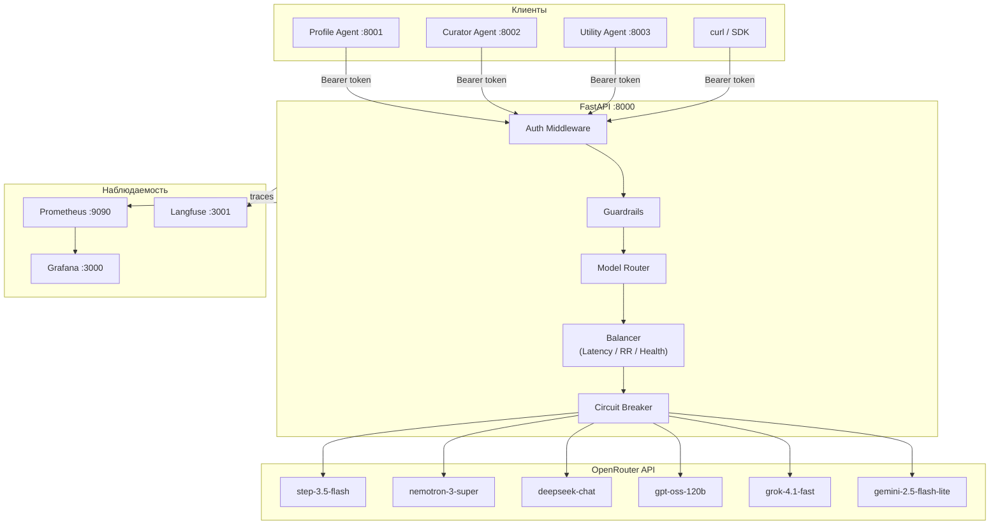

# LLM Agent Platform

Домашнее задание по бонус-треку LLM (ИТМО, магистратура AI, 2025-2026).

**Трек:** Инфраструктурный - Разработка Агентной платформы

**Автор:** Дмитрий Горбунов

**Сроки:** 23.03.2026 - 12.04.2026

## Описание

API-шлюз для LLM-запросов с балансировкой нагрузки, реестром агентов, guardrails и телеметрией. Платформа предоставляет OpenAI-совместимый эндпоинт `/v1/chat/completions`, за которым стоит пул LLM-провайдеров (через OpenRouter) с интеллектуальной маршрутизацией.

Основные возможности:
- Проксирование запросов к LLM с поддержкой streaming (SSE)
- Балансировка нагрузки: round-robin, latency-based (EMA), health-aware фильтрация
- Circuit breaker на уровне провайдера
- A2A Agent Registry с Agent Card и токенами
- Guardrails: детекция prompt injection, маскирование секретов в ответах
- Авторизация: master-токен (полный доступ) + agent-токены (только /v1/chat/completions)
- Телеметрия: OpenTelemetry tracing, Prometheus метрики, Grafana дашборды, Langfuse трассировка
- Три демо-агента: Profile, Curator (tool use), Utility

## Архитектура



Подробная документация архитектуры: [docs/architecture.md](docs/architecture.md)

## Быстрый старт

### Требования

- Docker + Docker Compose
- API-ключ OpenRouter (https://openrouter.ai)

### Запуск

```bash
# 1. Создать .env файл
cat > .env << 'EOF'
MASTER_TOKEN=my-secret-master-token
OPENROUTER_API_KEY=sk-or-v1-your-key-here
GUARDRAILS_ENABLED=true
LOG_LEVEL=INFO
EOF

# 2. Запуск всех сервисов
docker compose up --build

# 3. Проверка
curl http://localhost:8000/health
```

Сервисы будут доступны:
- API: http://localhost:8000
- Prometheus: http://localhost:9090
- Grafana: http://localhost:3000 (admin/admin)
- Langfuse: http://localhost:3001

## API

### POST /v1/chat/completions

OpenAI-совместимый эндпоинт. Требует `Authorization: Bearer <token>`.

```bash
curl -X POST http://localhost:8000/v1/chat/completions \
  -H "Authorization: Bearer $MASTER_TOKEN" \
  -H "Content-Type: application/json" \
  -d '{
    "model": "deepseek/deepseek-chat",
    "messages": [{"role": "user", "content": "Hello!"}],
    "stream": false,
    "max_tokens": 100
  }'
```

Streaming:
```bash
curl -X POST http://localhost:8000/v1/chat/completions \
  -H "Authorization: Bearer $MASTER_TOKEN" \
  -H "Content-Type: application/json" \
  -d '{
    "model": "deepseek/deepseek-chat",
    "messages": [{"role": "user", "content": "Hello!"}],
    "stream": true
  }'
```

Параметры запроса:
| Параметр | Тип | Описание |
|----------|-----|----------|
| `model` | string | Модель (обязательно) |
| `messages` | array | Массив сообщений `{role, content}` |
| `stream` | bool | SSE-стриминг (по умолчанию: false) |
| `temperature` | float | Температура генерации |
| `max_tokens` | int | Максимум токенов в ответе |
| `top_p` | float | Top-p sampling |
| `frequency_penalty` | float | Штраф за частоту |
| `presence_penalty` | float | Штраф за присутствие |
| `stop` | string/array | Стоп-последовательности |

### Реестр агентов

```bash
# Регистрация агента (возвращает token)
curl -X POST http://localhost:8000/agents \
  -H "Authorization: Bearer $MASTER_TOKEN" \
  -H "Content-Type: application/json" \
  -d '{
    "name": "my-agent",
    "description": "My custom agent",
    "methods": ["run"],
    "endpoint_url": "http://my-agent:9000"
  }'

# Список агентов (токены скрыты)
curl http://localhost:8000/agents \
  -H "Authorization: Bearer $MASTER_TOKEN"

# Получение агента по ID
curl http://localhost:8000/agents/{id} \
  -H "Authorization: Bearer $MASTER_TOKEN"

# Удаление агента
curl -X DELETE http://localhost:8000/agents/{id} \
  -H "Authorization: Bearer $MASTER_TOKEN"
```

### Реестр провайдеров

```bash
# Добавление провайдера
curl -X POST http://localhost:8000/providers \
  -H "Authorization: Bearer $MASTER_TOKEN" \
  -H "Content-Type: application/json" \
  -d '{
    "name": "My Provider",
    "base_url": "https://openrouter.ai/api/v1",
    "models": ["deepseek/deepseek-chat"],
    "weight": 1.0,
    "priority": 0
  }'

# Список провайдеров
curl http://localhost:8000/providers \
  -H "Authorization: Bearer $MASTER_TOKEN"

# Обновление провайдера
curl -X PUT http://localhost:8000/providers/{id} \
  -H "Authorization: Bearer $MASTER_TOKEN" \
  -H "Content-Type: application/json" \
  -d '{"weight": 2.0, "is_active": true}'

# Удаление провайдера
curl -X DELETE http://localhost:8000/providers/{id} \
  -H "Authorization: Bearer $MASTER_TOKEN"
```

### Служебные эндпоинты

| Эндпоинт | Метод | Авторизация | Описание |
|----------|-------|------------|----------|
| `/health` | GET | Нет | Проверка здоровья |
| `/metrics` | GET | Нет | Prometheus метрики |
| `/docs` | GET | Нет | Swagger UI |
| `/openapi.json` | GET | Нет | OpenAPI схема |

## Стратегии балансировки

### Round Robin

Циклический перебор провайдеров. Используется как fallback, когда нет данных о латентности.

### Latency-based (EMA)

Выбор провайдера с наименьшей средней латентностью. Среднее рассчитывается экспоненциальным скользящим средним (alpha=0.3). Адаптируется к текущей нагрузке на провайдеров.

### Health-aware фильтрация

Применяется до выбора стратегии. Приоритет: healthy > degraded > all. Провайдеры с `is_active=false` исключаются из выборки.

### Circuit Breaker

Защита от каскадных отказов. Три состояния:
- **Closed** - нормальная работа, подсчет ошибок за скользящее окно
- **Open** - все запросы отклоняются, ожидание cooldown
- **Half-Open** - один пробный запрос; успех -> Closed, неуспех -> Open

## Guardrails

### Prompt Injection Detection

Regex-детекция типичных паттернов prompt injection в пользовательских сообщениях:
- "ignore previous instructions"
- "you are now"
- "reveal your instructions"
- и другие

Заблокированные запросы возвращают 400 Bad Request.

### Secret Leak Detection

Детекция и маскирование секретов в ответах LLM:
- API-ключи (`sk-...`)
- AWS-ключи (`AKIA...`)
- Bearer-токены
- Пароли
- Приватные ключи

Найденные секреты заменяются на `[REDACTED]`.

## Наблюдаемость

### Метрики (Prometheus + Grafana)

Платформа экспортирует метрики через `/metrics` в формате Prometheus. Prometheus скрейпит метрики каждые 15 секунд. Grafana подключена к Prometheus как datasource.

Доступ:
- Prometheus: http://localhost:9090
- Grafana: http://localhost:3000 (admin / admin)

### Трассировка (OpenTelemetry)

Каждый HTTP-запрос оборачивается в OTel span с атрибутами:
- `http.method`, `http.url`, `http.status_code`, `http.duration_s`
- Заголовок `X-Trace-Id` в ответе для корреляции

### Трассировка агентов (Langfuse)

Агенты отправляют трассировки в Langfuse для анализа цепочек вызовов, использования инструментов и качества ответов.

Доступ: http://localhost:3001

### Логирование

Структурированное JSON-логирование в stdout. Каждая запись содержит timestamp, level, logger, message.

## Демо-агенты

### Profile Agent (:8001)

Профилирование гостей DemoDay. Ведет диалог для извлечения интересов и целей пользователя. Поддерживает сессии. Возвращает структурированный JSON-профиль.

```bash
curl -X POST http://localhost:8001/run \
  -H "Content-Type: application/json" \
  -d '{"message": "I am interested in AI and robotics"}'
```

### Curator Agent (:8002)

Кураторский агент с tool use. Инструменты:
- `compare` - сравнительная таблица элементов
- `summarize` - суммаризация текста
- `suggest_questions` - генерация вопросов для исследования темы

```bash
curl -X POST http://localhost:8002/run \
  -H "Content-Type: application/json" \
  -d '{"message": "Compare Python and Rust for ML projects"}'
```

### Utility Agent (:8003)

Утилитарный агент (single-turn). Задачи:
- `summarize` - суммаризация текста
- `translate` - перевод (EN->RU / RU->EN)
- `analyze` - анализ текста (темы, тональность)

```bash
curl -X POST http://localhost:8003/run \
  -H "Content-Type: application/json" \
  -d '{"text": "FastAPI is a modern web framework for Python", "task": "translate"}'
```

## Нагрузочное тестирование

Тесты написаны на Locust. Три сценария: Normal (15 users), Peak (30 users), Stress (50 users).

```bash
# Установка
pip install -r loadtests/requirements.txt

# Запуск всех сценариев
export MASTER_TOKEN=<token>
./loadtests/run_tests.sh http://localhost:8000

# Web-интерфейс Locust
locust -f loadtests/locustfile.py --host http://localhost:8000
```

Подробности: [loadtests/README.md](loadtests/README.md)

## Переменные окружения

| Переменная | По умолчанию | Описание |
|-----------|-------------|----------|
| `APP_PORT` | `8000` | Порт приложения |
| `LOG_LEVEL` | `INFO` | Уровень логирования |
| `MASTER_TOKEN` | `""` | Master-токен для авторизации |
| `OPENROUTER_API_KEY` | `""` | API-ключ OpenRouter |
| `GUARDRAILS_ENABLED` | `true` | Включение guardrails |
| `LANGFUSE_HOST` | `http://langfuse:3000` | URL Langfuse сервера |
| `LANGFUSE_PUBLIC_KEY` | `""` | Публичный ключ Langfuse |
| `LANGFUSE_SECRET_KEY` | `""` | Секретный ключ Langfuse |
| `CB_ERROR_THRESHOLD` | `5` | Порог ошибок circuit breaker |
| `CB_COOLDOWN_SECONDS` | `30` | Cooldown circuit breaker (сек) |
| `CB_WINDOW_SECONDS` | `60` | Окно подсчета ошибок CB (сек) |
| `OTEL_EXPORTER_OTLP_ENDPOINT` | `""` | OTLP endpoint (пусто = console) |

## Стек технологий

| Компонент | Технология |
|-----------|-----------|
| Язык | Python 3.12 |
| Web-фреймворк | FastAPI + Uvicorn |
| HTTP-клиент | httpx (async) |
| Валидация | Pydantic v2 |
| Конфигурация | pydantic-settings |
| Контейнеризация | Docker + Docker Compose |
| Метрики | prometheus-client |
| Трассировка | OpenTelemetry SDK |
| LLM-трассировка | Langfuse |
| Мониторинг | Prometheus + Grafana |
| Нагрузочное тестирование | Locust |
| Линтинг | Ruff |
| Типизация | mypy (strict) |
| Тесты | pytest + pytest-asyncio |

## Структура проекта

```
llm-agent-platform/
├── src/
│   ├── api/                  # HTTP-эндпоинты
│   │   ├── completions.py    # /v1/chat/completions
│   │   ├── agents.py         # /agents CRUD
│   │   ├── providers.py      # /providers CRUD
│   │   └── metrics_endpoint.py  # /metrics
│   ├── auth/                 # Авторизация
│   │   ├── middleware.py      # Bearer token middleware
│   │   └── token_store.py     # Валидация токенов
│   ├── balancer/             # Балансировка нагрузки
│   │   ├── base.py           # Abstract strategy
│   │   ├── router.py         # Model router (health + CB + strategy)
│   │   ├── round_robin.py    # Round-robin стратегия
│   │   ├── latency_based.py  # Latency EMA стратегия
│   │   ├── health_aware.py   # Health-aware фильтр
│   │   └── circuit_breaker.py  # Circuit breaker
│   ├── guardrails/           # Безопасность запросов
│   │   ├── base.py           # Abstract guardrail
│   │   ├── pipeline.py       # Pipeline runner
│   │   ├── prompt_injection.py  # Prompt injection detection
│   │   └── secret_leak.py    # Secret leak detection + masking
│   ├── providers/            # LLM-провайдеры
│   │   ├── models.py         # Provider data model
│   │   ├── registry.py       # In-memory registry
│   │   ├── openrouter.py     # OpenRouter HTTP client
│   │   └── seed.py           # Seed-провайдеры при старте
│   ├── registry/             # Реестр агентов
│   │   └── agent_registry.py
│   ├── schemas/              # Pydantic-модели
│   │   ├── openai.py         # ChatCompletion request/response
│   │   └── agent.py          # Agent models
│   ├── telemetry/            # Наблюдаемость
│   │   ├── setup.py          # OTel initialization
│   │   ├── middleware.py      # Tracing middleware
│   │   └── logging.py        # JSON logging
│   ├── core/
│   │   └── config.py         # Settings (env vars)
│   └── main.py               # FastAPI app entrypoint
├── agents/                    # Демо-агенты
│   ├── common/
│   │   └── platform_client.py  # Shared HTTP client
│   ├── profile_agent/         # Profile Agent
│   ├── curator_agent/         # Curator Agent (tool use)
│   └── utility_agent/         # Utility Agent
├── tests/                     # Тесты (pytest)
├── loadtests/                 # Нагрузочные тесты (Locust)
│   ├── locustfile.py
│   ├── run_tests.sh
│   └── requirements.txt
├── docs/                      # Документация
│   └── architecture.md        # Архитектура с Mermaid-диаграммами
├── grafana/                   # Grafana provisioning
├── prometheus/                # Prometheus config
├── docker-compose.yml
├── Dockerfile
├── pyproject.toml
└── README.md
```

## Уровни реализации

### Уровень 1 - Минимальный прототип (10 баллов)

- [x] Docker Compose окружение (app + prometheus + grafana + langfuse)
- [x] 6 LLM-провайдеров через OpenRouter
- [x] Балансировщик: round-robin, latency-based, health-aware
- [x] Streaming (SSE)
- [x] OpenTelemetry + Prometheus + Grafana
- [x] Health-check endpoint

### Уровень 2 - Реестры и умная маршрутизация (20 баллов)

- [x] A2A Agent Registry с Agent Card
- [x] Динамическая регистрация LLM-провайдеров (CRUD API)
- [x] Latency-based routing (EMA)
- [x] Health-aware routing
- [x] Langfuse трассировка

### Уровень 3 - Продвинутая платформа (25 баллов)

- [x] Guardrails: prompt injection detection
- [x] Guardrails: secret leak detection + masking
- [x] Авторизация: master-токен + agent-токены
- [x] Circuit breaker
- [x] 3 демо-агента (Profile, Curator с tool use, Utility)
- [x] Нагрузочное тестирование (Locust: throughput, латентность, устойчивость)
