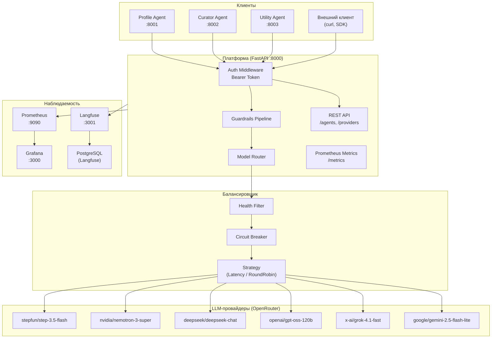
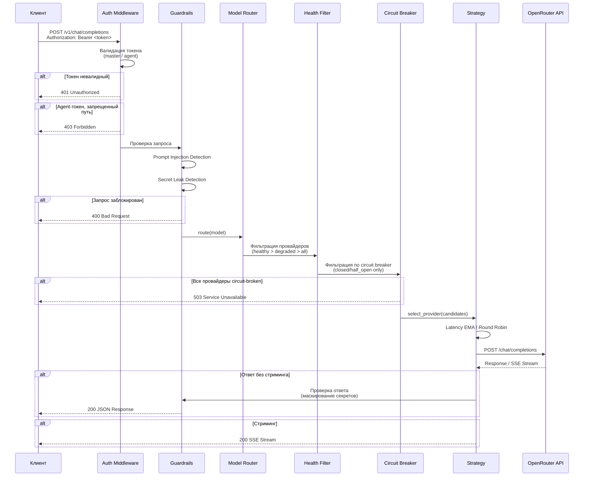
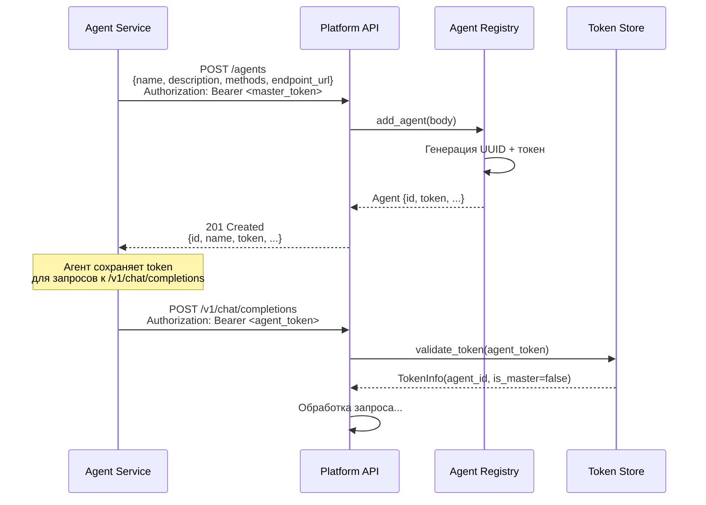
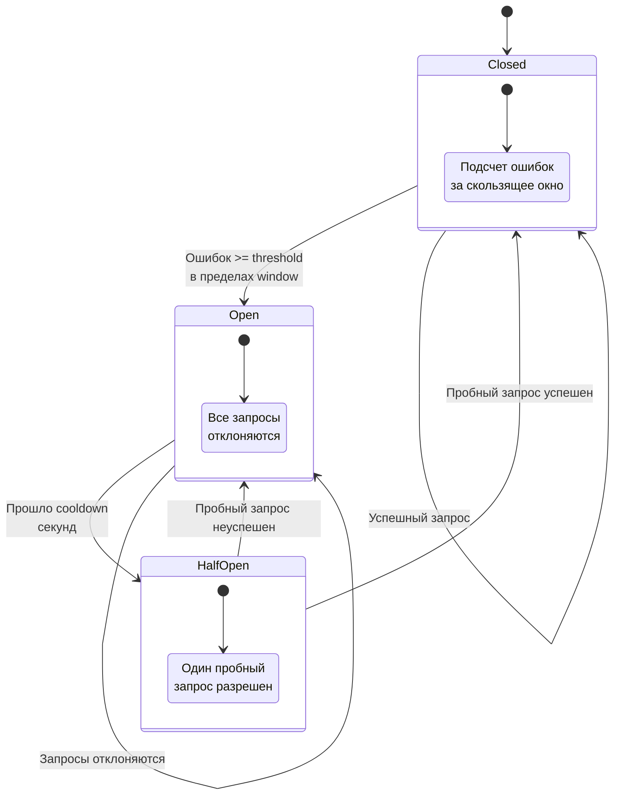
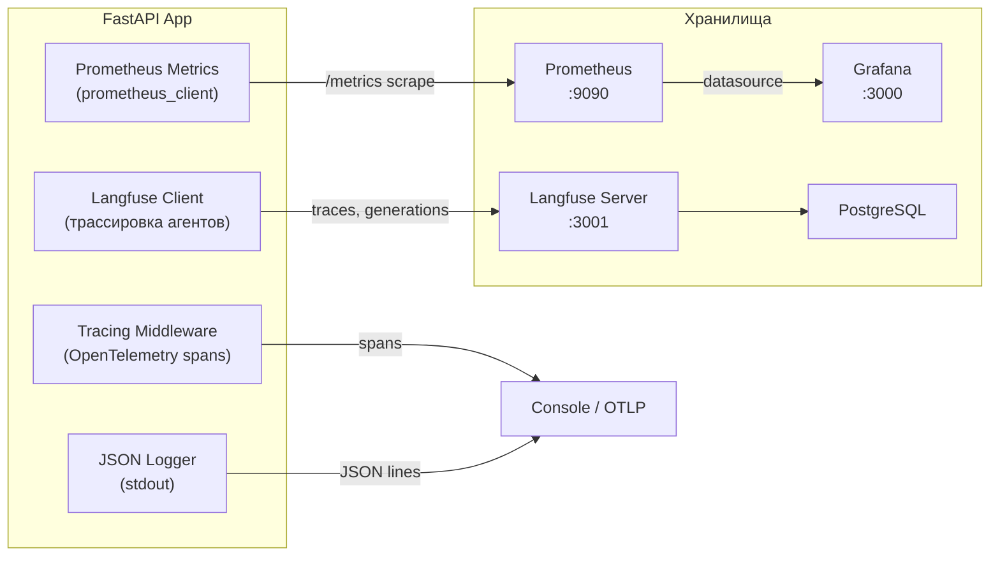

# Архитектура LLM Agent Platform

## Обзор системы

## Поток обработки запроса

## Регистрация агента

## Circuit Breaker - диаграмма состояний

Параметры (env vars):
- `CB_ERROR_THRESHOLD` - порог ошибок (по умолчанию: 5)
- `CB_COOLDOWN_SECONDS` - время в состоянии Open (по умолчанию: 30)
- `CB_WINDOW_SECONDS` - окно подсчета ошибок (по умолчанию: 60)

## Поток данных наблюдаемости

### Собираемые метрики

| Метрика | Тип | Описание |
|---------|-----|----------|
| `http.method` | span attr | HTTP-метод запроса |
| `http.url` | span attr | URL запроса |
| `http.status_code` | span attr | Код ответа |
| `http.duration_s` | span attr | Время обработки запроса |
| `X-Trace-Id` | header | ID трассировки для корреляции |

## Компоненты

### Платформа (src/)

| Модуль | Описание |
|--------|----------|
| `api/completions.py` | OpenAI-совместимый прокси `/v1/chat/completions` с поддержкой streaming |
| `api/agents.py` | CRUD API реестра агентов |
| `api/providers.py` | CRUD API реестра провайдеров |
| `api/metrics_endpoint.py` | Prometheus scrape endpoint `/metrics` |
| `auth/middleware.py` | Bearer-токен аутентификация (master + agent токены) |
| `auth/token_store.py` | Валидация токенов из конфига и реестра агентов |
| `balancer/router.py` | Маршрутизатор: health filter -> circuit breaker -> strategy |
| `balancer/round_robin.py` | Round-robin стратегия по модели |
| `balancer/latency_based.py` | Выбор провайдера с наименьшей латентностью (EMA) |
| `balancer/health_aware.py` | Фильтрация по статусу здоровья (healthy > degraded > all) |
| `balancer/circuit_breaker.py` | Circuit breaker по провайдеру (closed/open/half_open) |
| `guardrails/pipeline.py` | Последовательный запуск гарантий безопасности |
| `guardrails/prompt_injection.py` | Детекция prompt injection по regex-паттернам |
| `guardrails/secret_leak.py` | Детекция и маскирование утечек секретов в ответах |
| `providers/openrouter.py` | HTTP-клиент для OpenRouter API (stream + non-stream) |
| `providers/registry.py` | In-memory реестр провайдеров с async-блокировками |
| `providers/seed.py` | Начальная загрузка провайдеров при старте |
| `telemetry/setup.py` | Инициализация OpenTelemetry (console / OTLP exporter) |
| `telemetry/middleware.py` | Tracing middleware - span на каждый HTTP-запрос |
| `telemetry/logging.py` | Структурированное JSON-логирование |

### Агенты (agents/)

| Агент | Порт | Описание |
|-------|------|----------|
| Profile Agent | 8001 | Профилирование гостей DemoDay: извлечение интересов и целей через диалог |
| Curator Agent | 8002 | Кураторский агент с tool use: compare, summarize, suggest_questions |
| Utility Agent | 8003 | Утилитарный агент: summarize, translate, analyze (single-turn) |

Все агенты используют общий `PlatformClient` для регистрации и обращения к платформе.
